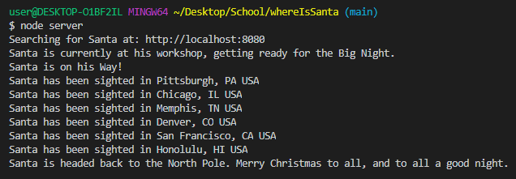
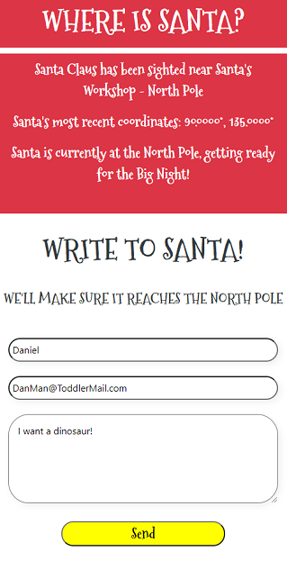

# Where Is Santa?

Where Is Santa? is a full-stack application using Node.js, MongoDB, and Mongoose to follow Santa's journey.

In the 80's and 90's my father worked for a defense contractor, and on Christmas Eve each year we would call 1-877-HI-NORAD - where the North American Aerospace Defense Command would, in addition to its other duties, track the location of Santa Claus throughout the night.

As a parent of two young boys and someone fairly new to coding, I created Where Is Santa? to replicate something similar for myself and others to share with any of the children in their life. 

# Features:

## Track Santa's Location

The server will, on startup, communicate with the elves to see if Santa is at the North Pole. It will then count down until the Big Day - our helpers have informed us that Santa departs at 8pm sharp on December 24th. 

Once Santa has departed, the Server will periodically check the database for his current location using our worldwide network of elves on the ground. Each time Santa is located, our database will automatically update, and the app will display his current location on the map. 

If you've allowed Location permissions and Santa is near your area, he will inform you if he'll have to come back later, once everyone is asleep. 

## Write to Santa

Write a letter to Santa, and he'll send back a personalized e-mail! He's been incredibly busy, as usual, so this year he's had an amateur web developer automate his letter-writing process with Nodemailer. 

## Deployed Site: 
https://whereissanta.herokuapp.com/ 

## Is Santa Coming to My Town?: 
Santa's Helpers have informed me that he will visit no less than 160 cities across the world before 4am. 

If you'd like to contribute additional city coordinates to search for Santa, please refer to the seed data and email nlamonaco86@gmail.com so I can let the elves know where else to look. 

## CURRENT ISSUES:
I am aware that Santa's location does not seem to behave with regards to international time zones as we currently understand them. I have reached out to some of the foremost scientists in the entire world, who informed me that it's "just the Magic of the season."

## Table of Contents

* [Installation](#installation)
* [Usage](#usage)

## Installation

Once you've cloned the repo,

```
npm install
```

Create a file in the root directory called .env
In this file, write the following (without placeholders, of course):
```
EMAIL_SERVICE=serviceName
EMAIL_USERNAME=yourName@email.com
EMAIL_PASSWORD=yourPassword
```

Next, navigate to the seeders folder
```
npm run seed
```

Then, in the root directory:
Take a look at server.js, and edit the dates if necessary for testing

Finally, 

```
node server
```

If there are no environment variables for email set, the e-mail features will not work. Note that gmail and other providers may require you to enable "less secure" options in order to work with Nodemailer - consider using a spare or temporary email for this purpose. 

## Usage





## Questions

Contact [Nlamonaco86](mailto:nlamonaco86@gmail.com) with any questions or suggestions!
